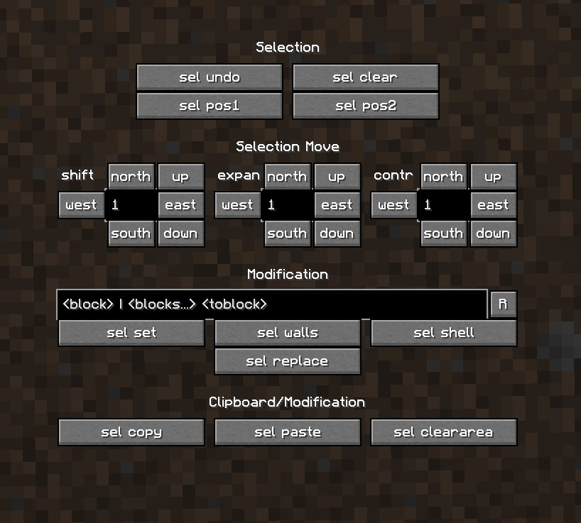

# builder-macro-screen
Builder's GUI screen for the jsMacro mod in Minecraft. Contains handy w/e command shortcuts that I use a lot.

## Installation

1. Install a jsMacro mod for Fabric or Forge.
2. Locate the Macros folder where your jsMacros is looking for the js files to execute (can be done through jsMacros GUI).
3. Paste the contents of this repository inside that folder. Or clone this folder instead of that one.
4. Attach the `WEScreen/WorldJoin.js` file to the `WorldJoin` Event, inside your jsMacros GUI (go to Controls to see how to open your jsMacro GUI)
5. Attach the `WEScreen/OpenWEScreen.js` to the key that you would like to open the screen with.

