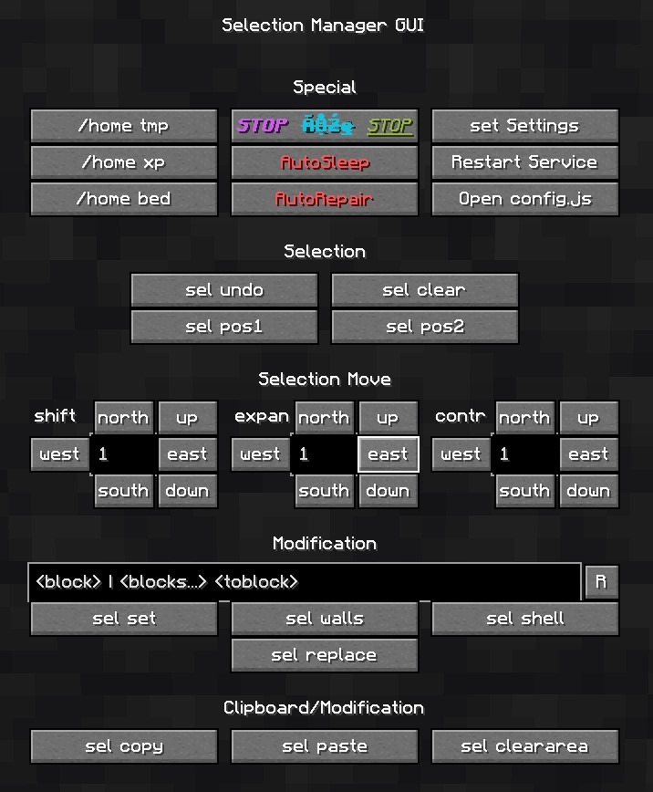

# builder-macro-screen
Builder's GUI screen for the jsMacro mod in Minecraft. Contains handy w/e command shortcuts that I use a lot.

## Installation

1. Install a jsMacro mod for Fabric or Forge.
2. Locate the Macros folder where your jsMacros is looking for the js files to execute (can be done through jsMacros GUI).
3. Paste the contents of this repository inside that folder. Or clone this folder instead of that one.
4. Attach the `WEScreen/WorldJoin.js` file to the `WorldJoin` Event, inside your jsMacros GUI (go to Controls to see how to open your jsMacro GUI)
5. Attach the `WEScreen/OpenWEScreen.js` to the key that you would like to open the screen with.

## For absolute modding newbies
There are many modding launchers out there that are good. But I will be using GDLauncher for this guide, since it's open source, and avoids the drama that way.

1. Download GDLauncher from their [official website](https://gdevs.io/#downloadContainer)
2. Go through the installation steps.
3. Create a new profile with the newest version of Fabric that is available for your version of Minecraft. The process should be pretty intuitive. GDLauncher makes everything pretty easy.
4. After the profile was created, right click on it, and click "Manage".
5. Go to the "Mods" section on the left.
6. Click "Add Mod" (button should be on top of the panel)
7. Type in "JS Macros" and install the mod.
8. Launch the profile.
9. In Controls settings, set the button for the "JS Macro GUI".
10. Once you open it, find Events tab, add another event called WorldJoin, when selecting the file click "Open Folder". That way you found the folder where to put the script.
11. On this page, click on the green button "Code" and "Download ZIP"
12. unzip the contents into the Macros folder.
13. do steps 4 and 5 in the main instructions. 
14. Voila.
